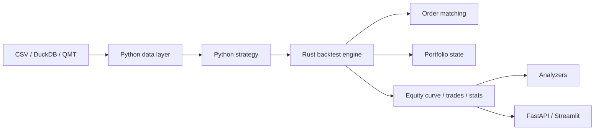

# pyrust-bt

<div align="center">
  
</div>

pyrust-bt is a hybrid backtesting framework for quantitative research: Python for strategy development and data workflows, Rust for high-performance execution through PyO3 bindings.

[Chinese README](README.zh-CN.md) | [Documentation](docs/index.md) | [Examples](docs/examples.md)

## Why pyrust-bt

- Write strategies in Python with a small lifecycle API.
- Run the hot path in Rust: bar iteration, order matching, portfolio state, indicators, and statistics.
- Use CSV for quick experiments, or DuckDB as a local market data store.
- Move from single-asset tests to multi-asset portfolio simulations.
- Analyze results with drawdowns, round trips, performance metrics, factor tests, and quantile portfolios.

## Quick Start

Prerequisites: Python 3.8+, Rust, and `maturin`.

```powershell
pip install maturin
cd rust/engine_rust
maturin develop --release
cd ../..
python examples/run_mvp.py
```

The Rust extension must be built before importing `pyrust_bt.api.BacktestEngine`.

## Minimal Example

When running your own script from the repository root, set `PYTHONPATH=python` or add the `python/` directory to `sys.path`.

```python
from pyrust_bt.api import BacktestConfig, BacktestEngine
from pyrust_bt.data import load_csv_to_bars
from pyrust_bt.strategy import Strategy


class BreakoutStrategy(Strategy):
    def next(self, bar):
        if bar["close"] > bar["open"]:
            return {"action": "BUY", "type": "market", "size": 1.0}
        return {"action": "SELL", "type": "market", "size": 1.0}


cfg = BacktestConfig(
    start="2020-01-01",
    end="2025-12-31",
    cash=100000.0,
    commission_rate=0.0005,
    slippage_bps=2.0,
    batch_size=1000,
)

bars = load_csv_to_bars("examples/data/sample.csv", symbol="SAMPLE")
result = BacktestEngine(cfg).run(BreakoutStrategy(), bars)

print(result["stats"])
```

## Learning Path

| Step | Topic | Guide |
|---|---|---|
| 1 | Install and build the Rust extension | [Getting Started](docs/getting-started.md) |
| 2 | Run the first backtest | [Getting Started](docs/getting-started.md) |
| 3 | Write strategies and actions | [Strategy Guide](docs/strategy-guide.md) |
| 4 | Understand the engine model | [Architecture](docs/architecture.md) |
| 5 | Pick the right demo | [Examples](docs/examples.md) |
| 6 | Use DuckDB and QMT data | [Market Data](docs/market-data.md) |
| 7 | Run factor research workflows | [Factor Analysis](docs/factor-analysis.md) |
| 8 | Fix build and import issues | [Troubleshooting](docs/troubleshooting.md) |

## Features

| Area | What is included |
|---|---|
| Rust engine | Bar iteration, market and limit orders, cost model, portfolio state, equity curve, statistics |
| Python API | Strategy lifecycle, data loading, analyzers, grid search, multi-asset entry point |
| Indicators | Rust vectorized SMA and RSI, Python SMA fallback |
| Multi-asset | `run_multi()` with per-symbol feeds and `next_multi(update_slice, ctx)` |
| Market data | CSV loading, DuckDB persistence, optional QMT / xtdata backfill |
| Factor research | IC, rank IC, monotonicity, factor ranking, quantile portfolio backtests |
| Web UI | FastAPI run service and Streamlit result viewer |

## Architecture



Read the full architecture notes in [docs/architecture.md](docs/architecture.md).

## Example Index

| Example | Command | Purpose |
|---|---|---|
| Minimal single-asset backtest | `python examples/run_mvp.py` | First smoke test |
| Analysis report | `python examples/run_analyzers.py` | Drawdowns, round trips, metrics |
| Grid search | `python examples/run_grid_search.py` | Parameter scanning |
| Multi-asset SMA | `python examples/run_multi_assets.py` | Basic `run_multi()` usage |
| DuckDB CSV import | `python examples/import_csv_to_db.py --help` | Local market data store |
| QMT-backed rebalance | `python examples/run_multi_asset_rebalance_strategy.py` | DB-first data with xtdata fallback |
| Cross-sectional factor sample | `python examples/run_cs_momentum_sample.py` | Factor ranking workflow |
| Quantile portfolios | `python examples/run_cs_quantile_portfolios.py` | Factor portfolio simulation |
| Performance benchmark | `python examples/run_performance_test.py` | Batch-size and speed checks |

See [docs/examples.md](docs/examples.md) for when to use each example.

## Engine Model

The current matching model is intentionally simple and research-oriented:

- Market orders fill on the current bar close.
- Limit orders use same-bar simplified execution.
- Commission and slippage are applied during fills.
- The engine tracks cash, position, average cost, equity, realized PnL, trades, and statistics.

Advanced market microstructure features such as order books, partial fills, stop orders, OCO orders, and persistent pending orders are planned extension points.

## Project Structure

```text
python/pyrust_bt/          Python API, strategy base class, analyzers, optimizer
python/server_main.py      FastAPI run service
frontend/streamlit_app.py  Streamlit frontend
rust/engine_rust/          Rust PyO3 extension and DuckDB data functions
examples/                  Runnable demos and research workflows
docs/                      User guides and technical documentation
doc/                       Product notes and historical design notes
```

## Web UI

```powershell
pip install fastapi uvicorn pydantic requests streamlit
python -m uvicorn python.server_main:app --reload
```

In another terminal:

```powershell
set PYRUST_BT_API=http://127.0.0.1:8000
streamlit run frontend/streamlit_app.py
```

## Performance Notes

- Use `batch_size=1000` to `5000` for large runs.
- Prefer Rust vectorized functions such as `compute_sma()` and `compute_rsi()`.
- Keep large datasets in columnar or database-backed formats when possible.
- Use the performance example before changing engine internals.

## Roadmap

- Matching: partial fills, order book simulation, stop and conditional orders.
- Data: Parquet / Arrow pipelines, stronger data feed abstraction, caching.
- Analysis: richer reports, multi-run comparison, HTML / PDF export.
- Optimization: random search, Bayesian search, parallel execution.
- Web: richer visualization, persisted runs, live progress updates.
- Quality: unit tests, integration tests, benchmarks, CI wheel builds.

## Community

Pull requests and issue reports are welcome.


## License

MIT

## Disclaimer

This project is for research and education only. It is not investment advice. You are responsible for your own trading decisions and risk management.
