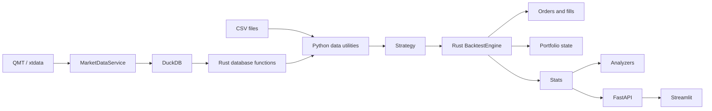
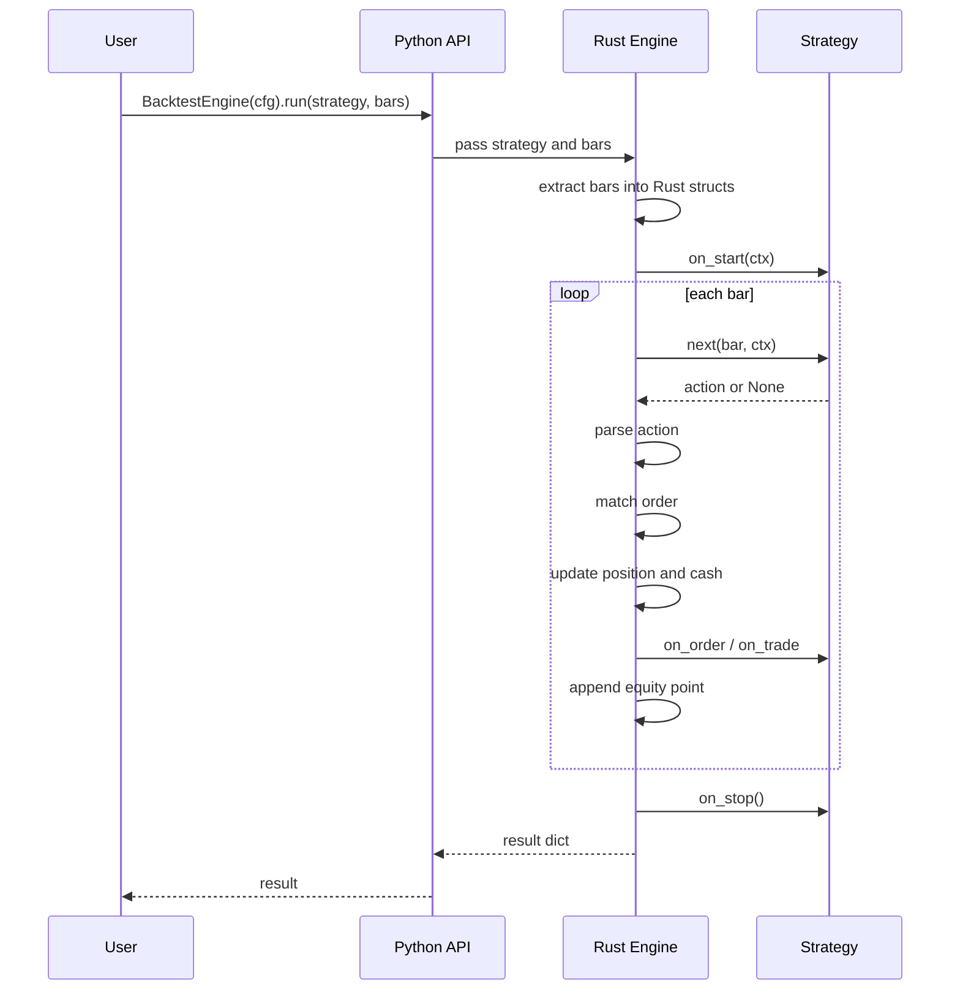

# Architecture

pyrust-bt separates research ergonomics from execution speed. Python owns the user-facing API and strategy code. Rust owns the hot path.

## System Overview



## Main Components

| Component | Responsibility |
|---|---|
| `python/pyrust_bt/api.py` | Thin Python wrapper around the Rust engine |
| `python/pyrust_bt/strategy.py` | Base strategy lifecycle |
| `python/pyrust_bt/data.py` | CSV to bar dictionaries |
| `python/pyrust_bt/analyzers.py` | Drawdowns, round trips, metrics, factor backtest |
| `python/pyrust_bt/optimize.py` | Grid search |
| `python/pyrust_bt/market_data/service.py` | DB-first market data service with optional xtdata fallback |
| `rust/engine_rust/src/lib.rs` | PyO3 module registration only |
| `rust/engine_rust/src/{config,model,indicators,engine_single,engine_multi,accounting,stats,factor}.rs` | Backtest engine modules (config, data model, indicators, single/multi-asset loops, accounting, stats, factor fast path) |
| `rust/engine_rust/src/database.rs` | DuckDB K-line storage and query functions |
| `python/server_main.py` | FastAPI run service |
| `frontend/streamlit_app.py` | Streamlit UI |

## Single-Asset Backtest Flow



## Multi-Asset Backtest Flow

`run_multi()` accepts:

```python
feeds = {
    "asset1": bars1,
    "asset2": bars2,
}
```

The Rust engine:

1. Extracts all feed bars.
2. Builds a combined timeline from bar datetimes.
3. Updates the latest bar snapshot for each feed.
4. Updates the shared `EngineContext` (cash, equity, positions, last prices) in place.
5. Calls `strategy.next_multi(update_slice, ctx)`.
6. Parses one action or a list of actions.
7. Updates per-symbol positions and portfolio cash.

## Data Architecture

The simplest path is CSV:

```text
CSV -> load_csv_to_bars() -> engine.run()
```

The production-style local path is DuckDB:

```text
CSV or QMT -> Rust save_klines() -> DuckDB -> Rust get_market_data() -> bars -> engine
```

`MarketDataService` implements:

```text
query DuckDB
  -> detect missing range
  -> download from xtdata when enabled
  -> save fresh data to DuckDB
  -> query DuckDB again
```

## Performance Design

The engine reduces Python overhead by:

- Extracting bar data before the loop.
- Preallocating result buffers.
- Reusing a single `EngineContext` instance per run, updated in place each bar.
- Passing the original bar objects straight through to the strategy instead of rebuilding per-bar dicts.
- Keeping position updates in Rust.
- Exposing vectorized indicators from Rust.

The strategy is still called from Python at every bar. That is intentional: users keep Python strategy flexibility, while the bookkeeping and matching path stays in Rust.

Note: because bar objects are passed through without copying, strategies must treat them as read-only. Mutating a bar mutates the user's original data and is unsupported.

## Known Boundaries

- The order model is same-bar simplified execution.
- Pending order lifecycle is not modeled yet.
- Multi-asset result output is currently portfolio-level, not a full per-symbol ledger.
- FastAPI run state is in memory.
- QMT / xtdata support depends on local vendor environment setup.
