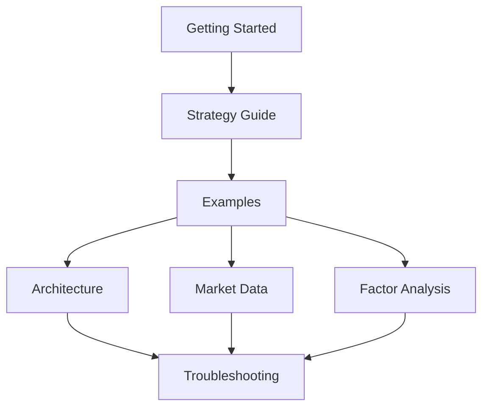

# pyrust-bt Documentation

This documentation is organized as a learning path first and a reference second. Start with the quick guides, then use the topic pages when you need a specific part of the framework.

## Start Here

1. [Getting Started](getting-started.md): install dependencies, build the Rust extension, and run the first backtest.
2. [Strategy Guide](strategy-guide.md): implement `Strategy`, return actions, and use callbacks.
3. [Examples](examples.md): choose the right runnable example for your task.
4. [Architecture](architecture.md): understand how Python, Rust, DuckDB, FastAPI, and Streamlit fit together.

## Topic Guides

| Guide | What it covers |
|---|---|
| [Market Data](market-data.md) | CSV, DuckDB, QMT / xtdata fallback, and local data persistence |
| [Factor Analysis](factor-analysis.md) | Single-factor tests, multi-factor reports, IC, rank IC, and quantile portfolios |
| [Troubleshooting](troubleshooting.md) | Import errors, build errors, data issues, and runtime checks |

## Recommended Reading Order

## Core Entry Points

| Component | File |
|---|---|
| Python engine wrapper | `python/pyrust_bt/api.py` |
| Strategy base class | `python/pyrust_bt/strategy.py` |
| CSV loader | `python/pyrust_bt/data.py` |
| Analyzers | `python/pyrust_bt/analyzers.py` |
| Grid search | `python/pyrust_bt/optimize.py` |
| Market data service | `python/pyrust_bt/market_data/service.py` |
| Rust engine | `rust/engine_rust/src/lib.rs` |
| Rust DuckDB functions | `rust/engine_rust/src/database.rs` |
| FastAPI service | `python/server_main.py` |
| Streamlit app | `frontend/streamlit_app.py` |
